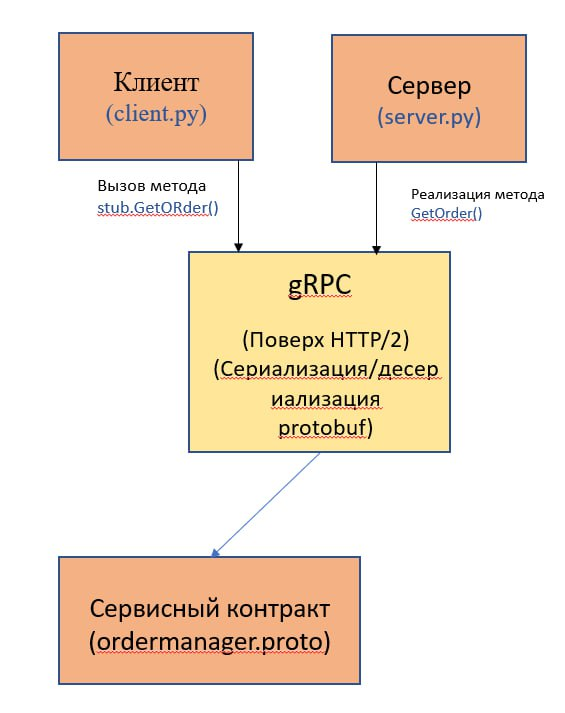
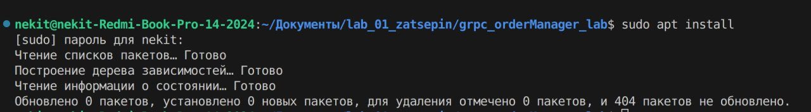
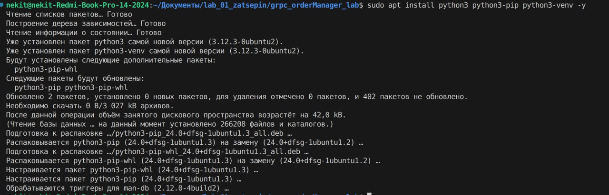
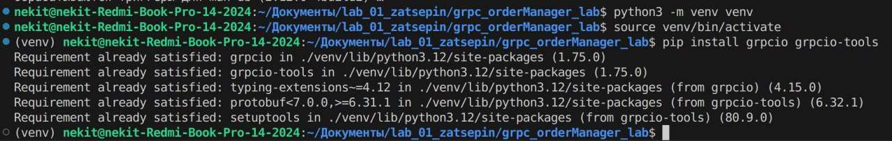
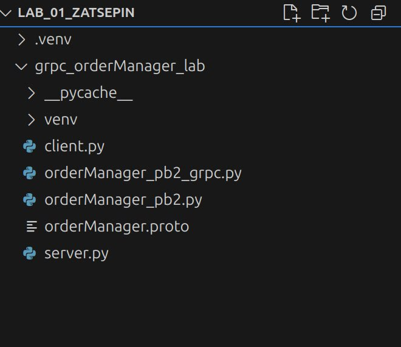
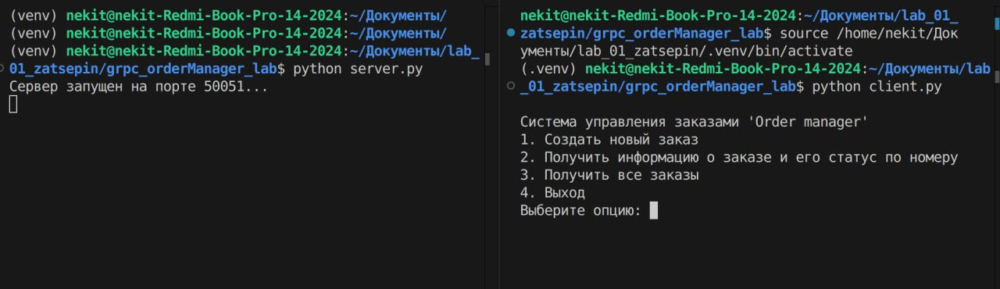
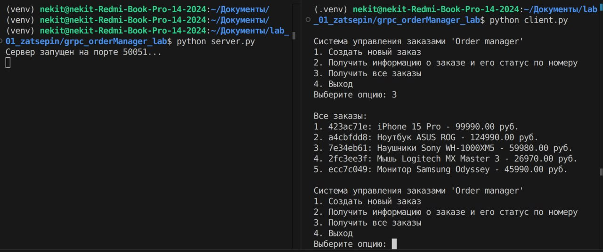

# Лабораторная работа 01. Реализация RPC-сервиса с использованием gRPC
## Выполнил: Зацепин Никита Алекссеевич АБП-231
## Цель работы:
1. Отработать приницпы удаленного вызова процедур (RPC), а также освоить принципы их применения в распределнных системах.
2. Изучить основы фреймворка gRPC и языка определения интерфейсов Protocol Buffers (Protobuf)
3. Научиться определять сервисы и сообщения с помощью protobuf
4. Реализовать клиент-серверное приложение на языке Python с использованием gRPC
5. Обрести практические навыки в генерации кода через proto, реализации серверной логики и клиентских вызовов для различных типов RPC.
## Описание предметной области:
1. Метод GetOrderStatus(OrderID) для получения
статуса заказа (Unary RPC).
## Архитектура
**В основе лабораторной работы лежит классическая клиент-серверная архитектура (Client-Server
Architecture), реализованная с помощью парадигмы удаленного вызова процедур (Remote Procedure Call - RPC).**
### 1. Компоненты 
**Сервер (Server). Это независимое приложение (server.py), которое выполняет основную "бизнес-логику".**\
Возможности:
* Предоставление сервисов, определенных в контракте
* Обработка входящих запросов на порту 50051
* Выполнение логики. Предоставление возможности взаимодействия с заказами

**Клиент (Client). Это приложение (client.py), которое потребляет функциональность, предоставляемую сервером.**
* Установка соединения с сервером на порту 50051
* Вызов удаленных методов на сервере
* Обработка ответов сервера, возврат их на экран
### 2.Взаимодействие и контракт
**Ключевым элементом архитектуры
является сервисный контракт (Service Contract), определенный в
файле orderManager.proto.**
* Какие сервисы доступны (OrderManager).
* Какие методы можно вызвать у каждого сервиса (get_order(), add_order(),get_all_orders(), create_order())).
* Какие данные (сообщения) эти методы принимают (self, request, context) и возвращают (OrderResponse).

### Технологический стек
1. Язык определения интерфейсов (IDL): Protocol Buffers (Protobuf)
2. Фреймворк RPC: gRPC
3. Транспортный протокол: HTTP/2
4. Язык программирования: Python 3
5. Ключевые библиотеки Python: a) grpcio b) grpcio-tools
6. Среда выполнения и изоляция: a) ОС: Ubuntu 20.04 (Linux). b) Виртуальное окружение (venv). Инструмент для изоляции зависимостей проекта, гарантирующий, что установленные пакеты (grpcio и др.) не будут конфликтовать с системными или другими проектами.
### Шаг 1. Подготовка окружения
В процессе подготовки окружения был подготвлен файл контракта (orderManager.proto) и установлены необходимые компоненты для проведения дальнейшей работы

### Шаг 2. Генерация кода
После подготовки окружения была выполнена генерация кода с помощью команды python -m grpc_tools.protoc -I. --python_out=. --grpc_python_out=.orderManager.proto. После выполнения команды из файла были сгенерированы необходимые классы для работы клиента и сервера.

### Шаг 3. Запуск и проверка
После проделанных действий были открыты 2 терминала, на одном из которых в окружении venv был запущен файл сервера, а на другом, в окружении venv был запущен файл клиента. После запуска в терминалах отобразились следующие сообщения: 

Далее, была выбрана опция отображения всех существующих заказов, после чего от сервера клиентом был получен ответ:

## Вывод:
В ходе лабораторной работы была реализована сервисная логика и простейший клиент-сервер по обработке заказов. Также в ходе работы были изучены принципы удаленного вызова процедур (RPC) и принципы применения их в распределенных системах.